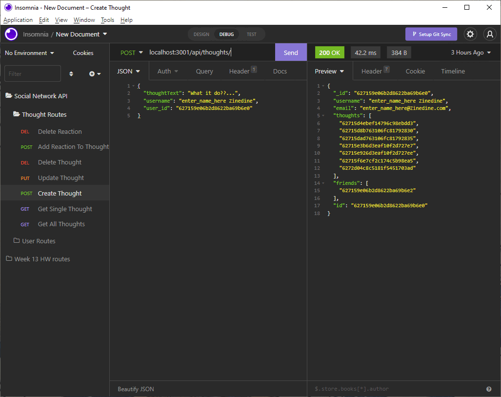

# Social Interweb Work API &middot; [](https://opensource.org/licenses/MIT)   
   
  This project serves as a simple example of how any given social media might organize their backend, this project however, dealing with a much smaller scale.  
     
  ## Table of Contents  
  &middot; [Installation](#installation)  
  &middot; [Contributing](#contributing)  
  &middot; [Walkthrough](#test)  
  &middot; [Questions](#walkthrough)  
  &middot; [License](#license)  
  
  # Installation and Starting   
  
  You will need MongoDB installed on your machine (https://www.mongodb.com/try/download/community). Then run 
  ```
  $ npm i
  ```
  to install necessary packages and 
  ```   
  $ npm run dev
  ```
  to start the server.

  # Walkthrough
  Below will be a walkthrough breakdown of all the various routes offered by this API.   

  * These are the GET routes made to return all users and all thoughts.   
      

  * These are the GET routes made to return a single user and a single thought based off an id given as a parameter.   
      
  
  * These are the PUT, POST, and DELETE routes for the user.  
      

  * These are the PUT, POST, and DELETE routes for thoughts.  
      

  * These are the POST and DELETE routes for friends.  
      

  * These are the POST and DELETE routes for reactions.  
    
   
  # Contributing  
    
  Have at it!   
   
  # Questions  
    
  GitHub: https://github.com/b-e-christensen  
  Email: dev.ben.christensen@gmail.com
   
  # License  
    
  This project is <a href="https://opensource.org/licenses/MIT" target="_blank">MIT</a> licensed.